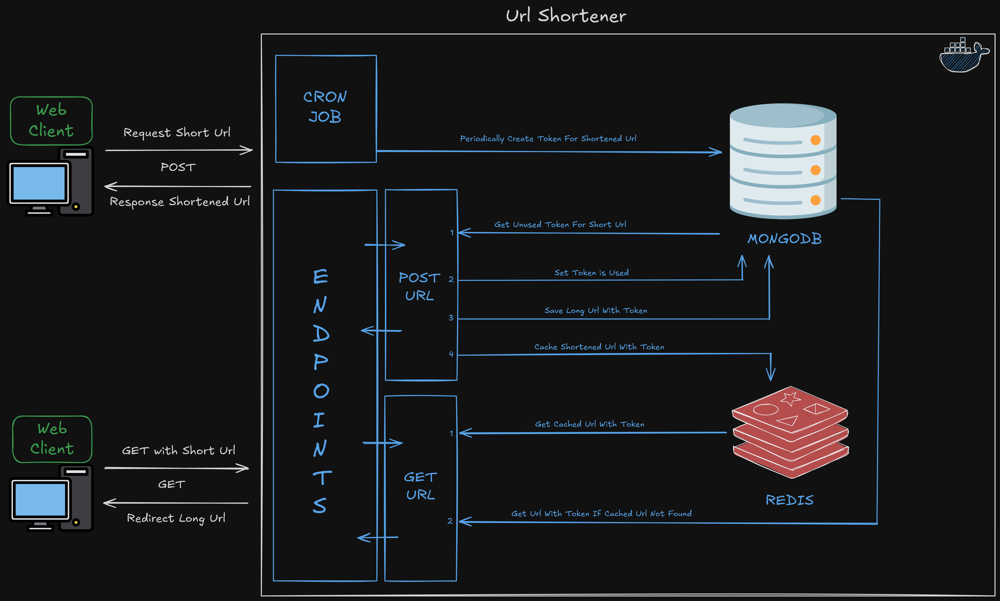

# Dotnet Minify Url
Dotnet 9 URL Shortener REST API Project example with MongoDB

# Architecture

# Dependencies
- [MongoDB](https://www.mongodb.com/try/download/community)
- [Redis](https://redis.io/download)
- [Docker](https://www.docker.com/products/docker-desktop)
- [Docker Compose](https://docs.docker.com/compose/install/)
- [Dotnet 9](https://dotnet.microsoft.com/download/dotnet/9.0)

# How to run
- Clone the repository with `git clone`
- Go to the project current directory
- Run `docker-compose up -d` to start MongoDB and Redis and the project

# Load Test With K6
- Install K6 with `brew install k6` or `choco install k6` or go to [K6 Download](https://grafana.com/docs/k6/latest/set-up/install-k6/)
- Open Terminal on the project directory
- Go to `test/LoadTestK6` directory
- Run `k6 run regular_load_test.js` to run the regular load test
- Run `k6 run progressive_load_test.js` to run the progressive load test
